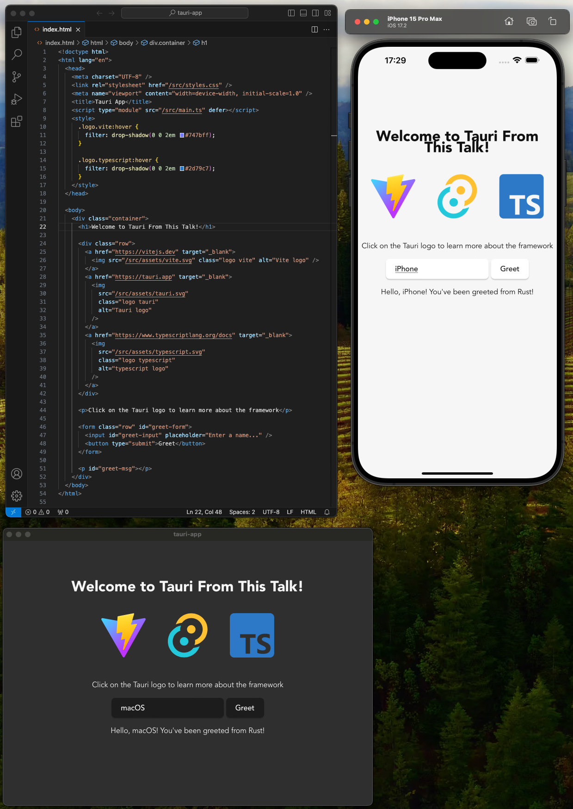
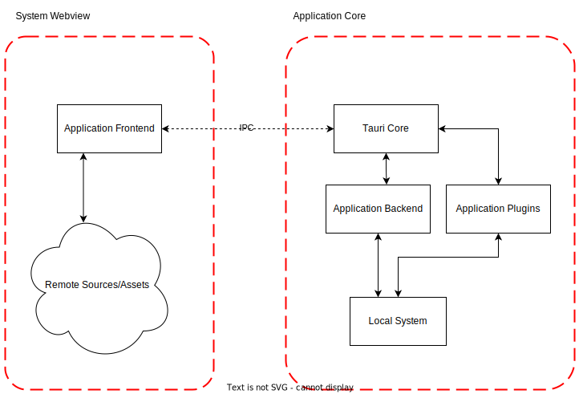
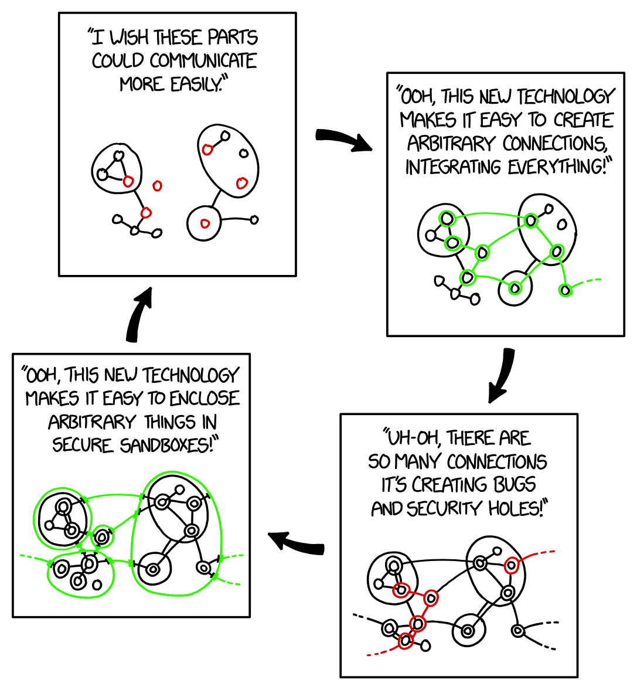

# Build Cross-Platform Apps Using Your Favorite Web Stack
### Reasonably Secure Edition

Hello and welcome everyone, thank you for joining us and taking the time to learn more about web-based cross-platform applications.
---
## What Will You Learn? 

To set expectations from the start, I will explain what this talk will and will not cover. Let's start with what's not in scope.

You won't learn about web development basics or frameworks, rust or how to get your finished apps into every available app store.

Instead, we will cover the whole story of what you should know before and while building your Tauri app.

Tauri is a cross-platform app development framework.

This talk will cover the basics of Tauri in version 2 and the development lifecycle with a focus on security considerations.
---
## What is an *App* really?

Before we get into the technical details, I would like to redefine some basic terms. We all know the word app and probably use it at least once a week, but what is the definition of an app and why is it so important in our everyday lives?

---
|----|
| > **Application software** |
| > **Mobile app**, software designed to run on smartphones and other mobile devices |
|> **Web application** or web app, software designed to run inside a web  |


If you look at the Wikipedia page for "app", you will see different definitions of the word, depending on the context.

We have the very broad term Application Software, which describes applications in a more formal sense, but this is too abstract and not relevant for this context, as we are talking about practical applications.

The next two interpretations are easier for us to understand because we can see directly where they are being used.

Everyone here probably has a mobile device running Android or iOS, and most of you will find the phrase "app" most appropriate when talking about apps installed on your mobile device via an app store.

The last definition is the web app, which is something you interact with every day when you open your favourite website.

Traditionally, the last two definitions of apps are distinct and require different technology stacks, knowledge and have their own learning curves.

From a web developer's perspective, this makes it harder to develop for mobile platforms using native features such as the camera and sensors, as they have to learn a new technology.

Native mobile developers tend to focus on specific native frameworks that have different concepts than a web app, so it's also difficult for them to support both definitions.

This is expensive and time-consuming for companies, and not every developer is willing to change their tech stack mid-career.

---
#### Web 
#### Native
#### Simple
## Tauri


This is where you can say hello to the new best friend of enterprises, web or native developers, and anyone who supports a diverse user base on their respective platform.

The framework I am about to introduce is called Tauri.

Tauri combines the categories of desktop, mobile and web applications, allowing you to build an application for every major operating system out there from a single code base.

It allows web developers to write cross-platform user interfaces the way they are used to, using their favourite web front-end framework, while interacting with the system the application is running on.

It allows native developers to focus on great backend functionality for each platform and leave the writing of consistent user interfaces to web developers. They can also write backends as plugins, which means the native interaction can be reused by many different projects.

---



Before we get into the more technical stuff, I would like to demonstrate a sample Tauri application running on MacOS and emulated iOS at the same time. 

It also supports Hot Module Reload (HMR). This means that any changes made to the front-end code in my editor are automatically displayed side-by-side on both platforms without recompiling the backend.

This is achieved using a local dev server. This also makes it possible to inspect and debug the frontend code in your local web browser.

In release builds, this feature is disabled and no port or server is exposed to the system.

Technically, you can run remote or local emulators such as Android, Linux, Windows and develop with Live Preview for all platforms at the same time.

Tauri theoretically runs on many more platforms depending on WebView and rust target support, so we have people experimenting with visionOS, watchOS, androidTV and even game consoles.
---
## The Tech Stack


.svg)


So let's have a look under the hood.

Tauri is primarily built using Rust, a powerful low-level programming language with a focus on security. 

Rust is said to have a steep learning curve compared to JavaScript or other high-level languages.
This is probably the biggest barrier for new developers, but for our focus on security, performance and binary size we had no real alternatives.

Rust is type-safe and has a very strict compiler, which enforces good engineering habits and prevents us from taking shortcuts in many places.

Some core concepts of Rust prevent classic memory vulnerabilities of low-level languages such as C/C++.

Tauri supports mobile operating systems, and to achieve this it needs a way to interact with the native mobile system APIs.

We considered staying Rust only, but this would have required us to build and maintain API bindings for each operating system. That would have been complex and tedious.

We try to pick the right tool for the job. This resulted in a small amount of wrapper code written in Kotlin and Swift that simplifies system API access from Rust.

Tauri combines two underlying libraries, also written in Rust.

Tao, which is responsible for handling, creating and interacting with native windows.

Wry, which is responsible for initialising and interacting with the WebViews used on the operating system.

Tauri uses WebViews to render and display the frontend code.
These are different on each operating system, and we will discuss later why this is actually an advantage in most scenarios.

On Windows, Tauri uses Webview2, which is based on Chromium. 
On Android it uses another Chromium-based WebView called Blink.

On Linux, it makes use of WebKitGTK, which is based on Webkit, which is used on MacOS and iOS.

For frontend developers, mentioning these WebView stacks means that you can use any frontend framework that works with these WebViews. We have templates for popular frameworks like React, Vue, Next.js, and even Rust based WebAssembly frontends like Yew work out of the box.

---
## WebViews
	To Bundle, or Not to Bundle?

Talking about web views brings us to an important question. To bundle or not to bundle?

The topic of directly bundling a WebView with application code that interacts with the native operating system is not new and has been used by a fair number of frameworks that have been around for a while.

At the beginning of Tauri this question was part of very important discussions.

A common application with a bundled WebView would easily exceed 100 megabytes with almost no functionality.

When playing the numbers game by simply calculating the traffic, disk space, environmental overhead and distribution latency for shipping a simple application to thousands of users, it was clear that relying on either pre-installed WebViews or providing an installer to install these WebViews on a system would be the more sustainable choice.

Another very important aspect from a security perspective influenced this decision and that is the security update lag.

---
.svg)


The issue of update lag is all about responsibility.

When bundling a WebView into your application, you as the developer are responsible for ensuring that the latest WebView security patches are included in your latest release.

This means that for each security update of the WebView you need to download or compile the latest available version, bundle it with your application code and then ensure that the latest version is distributed to your user base.

In practice, very few applications get this right and automate it well enough to keep up with the pace of WebView security updates.

For Tauri applications it is a different story, where you simply ship your application code and rely on the WebView being properly updated by the package manager or directly by the operating system.

In this case, the package or OS maintainer is responsible for keeping the WebView versions up to date.
In most cases, this process greatly reduces the time it takes to patch.

---
	Web vs Native
## Threat Model

The threats to a web application running in a browser are very different from the threats to a native application running directly on a system.

When you build a web application, the code is usually running on a web server that you own or at least control. When you run the application in a browser, you don't have to worry about other tabs, windows or things on the user's system.

The browser sandbox and environment will take care of that for you.

You can assume that your application won't be able to compromise the end user's device, so you only have to worry about risks from your application logic and, of course, your own bugs.

When building a native application, there is no browser sandbox or environment and you are responsible for writing code that does not compromise and break the user's device.

For the threat model of a Tauri application we need to consider a mix of both. But to fully understand where to apply which perspective, let us start with the general architecture of a Tauri and its trust boundaries.
---
	Tauri Architecture
## Trust Boundaries



A Tauri application consists of two main trust groups, the WebView maintained by the local system running the front-end code, and the native code of the Tauri application.

The WebView has access to the network but is isolated from full system access. Code written for the front-end must take into account the typical web threat model and, in Tauri's case, also be aware of exposed system features.

We call the native part the application core. It contains Tauri's core code, the application-specific backend code and the application plugins. Most of these components are written in Rust, but sometimes they use or interact with other native languages and bindings.

The native component has full access to the local system without any restrictions imposed by the Tauri framework. Realistically, there is no way for us to create a fully isolated runtime without spending most of our time building and maintaining it.

This means that we have to start with a certain level of trust. We trust application and plugin developers to write non-malicious Rust code.

As I said, Rust itself enforces some good habits, but these alone won't make your application reasonably secure.

We will talk later about what can still go wrong and what you can do to reduce the risks.

First, we'll focus on the WebView and how it communicates with the application core.

---
## IPC
	Communication across Trust Boundaries

To understand why we can separate the WebView from the application core into different trust groups, it is important to look at the Inter Process Communication, or IPC, between these components.

The frontend has no system access by default and all requests to access resources outside the WebView process must go through a well-defined communication protocol.

This communication takes place between the WebView process and the Tauri process, which means that there is no system wide exposure through a port or socket.
---
## Tauri Commands
### Rust Backend
```
#[tauri::command]
fn my_greeting(message: String) -> String {
  format!("{message} from Rust!")
}
```
### Javascript Frontend
```
invoke('my_greeting').then((message) => console.log(message))
```

To interact with the Rust based application core, Tauri has a concept called a command. This allows you to implement heavy computation or IO access logic in Rust. It is very easy to use and is used to expose system functionality to the frontend.

Tauri itself and existing Tauri plugins expose commonly requested features such as file system access using this command implementation. For the Rust aware audience: The returned data can be of any type as long as it implements `serde::Serialize`.

For front-end developers, many plugins already expose generated typescript bindings to their commands, so you can stay in your Intellisense comfort zone and write maintainable code.

---
## Recap
	Getting Beyond Basics

We've discussed the very basic Tauri knowledge and a very simplified, too long to listen to recap is required for the next few slides:

Tauri applications are local applications that run on the end user device, mobile or desktop, contain backends written primarily in Rust, frontend written in any web framework, communication exists between both components.

As mentioned earlier, web developers tend to live in a happy bubble, confined to a browser, with backend code running on a trusted server.
---
## Hostile Environment
	You can't trust anything!

The reality of local native applications is not so friendly and there is no trust in the local device executing the backend logic. So if you embed secrets in your app, you're really screwed: other apps will try to steal your data, users will reverse-engineer your code, you can't even trust the outcome of cryptographic operations because the system could always be manipulated.

This is scary from an app developer's perspective, but also from a user's perspective.

How can the user restrict apps to access only what they should?
How can app developers build their applications to regain some kind of trust?
---
## Sandboxing
	Finding The Balance

These old questions have led to an innovation in technology known as sandboxing.

Sandboxing allows developers, users and operating systems to define access controls to resources. The main problem with sandboxing is perfectly described in this [xkcd](https://xkcd.com/2044/).

---



Whenever you restrict something for security reasons, people feel restricted. They want something simpler and easier to use to get quick results.

They want something more communicative and easy to use, with no configuration required.

Then someone builds this easy-to-use open system, which then takes everyone who uses it back to square one, where sensitive data or access is overly shared again.

Security researchers will exploit this and come up with new isolation features to prevent abuse.

People will feel restricted again and look for simpler solutions.

This cycle repeats itself across all your devices and software frameworks.

---
## Container
	Just Put It in a Box

A common approach that most of you are probably familiar with is a container. This feature requires the operating system to integrate and provide privileged tools to isolate user level applications based on rules.

Popular desktop tools and frameworks include Docker, Flatpak and Snap. These solutions require either the developer to provide a runtime or instructions and configurations for the user to make it work.

There are built-in solutions such as the iOS and Android app isolation and permission system. Here the developer must provide manifests describing the desired system access and the user can grant or revoke this at runtime.

This approach can help to restrict system access after the application has been shipped, but it is usually not very fine-grained and it is difficult to find a balance between restrictions and usability.

---
## Application Logic Sandbox
	Reasonable Applications

A different approach is to consider the privileges and access requirements of an application at compile time. This requires developers to fully understand what access they need when they build their application. 

This can be very fine-grained, with a perfect balance between access restrictions and usability, as it is considered early in the development process.

This approach does not protect against other hostile applications on a system. Rather, it is designed to provide a level of trust between the developer and the user, while reducing the impact of security flaws within the application.

---
## Layered Security
	Swiss cheese

It is not trivial to maintain the balance of the sandbox. 

The Tauri framework provides reasonable ways to achieve this.

Tauri has built-in application level sandboxing features called capabilities, permissions and scopes.
Tauri is also compatible with, and tries to encourage, common container technologies such as Flatpak.

This allows end users to restrict applications, isolate applications from each other, and developers to restrict access at compile time to reduce the impact of run-time compromises.

Let's explore Tauri's built-in sandboxing capabilities.

---
## Permissions
	Define Command Exposure
```
[[permission]]
identifier = "my-permission"
description = "Reading files is only exposed on Windows"
platforms = ["Windows"]
commands.allow = [
    "fs:read_file"
]
```

Permissions are descriptions of the explicit permissions of Tauri commands.

We have already discussed what a Tauri command is. What we did not discuss there is that plugins can have a lot of different functionality and not every application using the plugin needs all the exposed commands.

So to reduce this over-exposure, the application developer can configure which commands are exposed in their application at compile time.

Plugin developers can provide out-of-the-box permissions that enable single commands or a set of commonly used commands.

Sometimes this exposure only makes sense on certain platforms, so it is possible to list the platforms to which a particular assumption-based permission applies.

This example allows the `read_file' command to be exposed on Windows builds only. It uses the `fs' filesystem plugin, which is indicated by the namespace in front of the command name.

Permissions can also be used to fine-tune access to enabled commands by using something called scopes.

---
## Scopes
	Define Fine Grained Access
```
[[scope.allow]]
path = "$HOME/*"

[[scope.deny]]
path = "$HOME/secret"
```

Scopes allow you to extend permissions so that the application or plugin developer can go beyond simply enabling or disabling commands.

This example is an extension of the previous permission, and allows our application to read the contents of the home folder, while preventing access to the secret folder.

The scope type is defined by the plugin developer and can be of any serialisable type. Of course, application developers can extend or define their own scope values.

In this example we are configuring the `fs` scope type `path`, which is a string containing `glob` pattern paths.

Each command can either define it's own scope type or use one type for the whole plugin.

The important thing to note here is that even if the configured scope is correct and safe, the command developer must verify the scope correctly.

This means that it is very important that plugin developers get this component right and do proper security checks.

Since Tauri does not know what your commands implement, we can only provide mechanisms that make it easy to build proper access control.

Ultimately, it will run on the user's device with your application code.

---
## Capabilities
```
{
  "identifier": "mobile-capability",
  "windows": ["main"],
  "platforms": ["iOS", "android"],
  "permissions": [
    "nfc:allow-scan",
    "biometric:allow-authenticate",
    "barcode-scanner:allow-scan"
  ]
}
```

The final component of the access control system in Tauri is the capability.

A capability attaches permissions to windows or WebViews.

This is what application developers need to configure and where they rely on plugin or backend developers to have scoping properly implemented.

Tauri itself enforces the exposure of commands and ensures that the correct scope is passed to the command itself.

This example function exposes the NFC functionality to scan tags with `nfc:allow-scan`, the biometric authentication by enabling `biometric:allow-authenticate` and the barcode scanning functionality with `barcode-scanner:allow-scan`.

All these commands are only exposed on iOS and Android and only to the `main' window. If the underlying permissions are not intended for these platforms, they are simply ignored.

Because Tauri applications run with multiple windows or WebViews, they can host different content with different security assumptions.

The capabilities also allow to define if a remote website is loaded in the WebView and should get access to the Tauri APIS. This is quite dangerous, so we don't allow it by default and it must be explicitly configured.

As the application developer, you should know best what the threat model is for each window and the commands used.

The complete model of permissions, scopes and capabilities is designed to streamline and simplify access control by providing a common interface for application and plugin developers.

This can be extended at runtime, depending on plugin support.
---
## Isolation Pattern
	Frontend Developer's Hidden Power

Another approach to restrict and control the exposure of the Tauri core to the frontend can be handled by the frontend developer themselves, using another built-in feature of Tauri.

This feature can be easily enabled in the configuration and injects a top level iFrame into the web application and all application frontend code is run in a sub iFrame.
We call this approach "Isolation Pattern".

This means that all IPC communication first passes through the isolation iFrame via `postMessage`.
This iFrame can be used to inspect, modify or block the communication by writing this logic in JavaScript.

We can imagine developers wiring their own web application firewall (WAF) or using it to detect compromise.

We haven't seen massive real-world adoption of this feature, so there are probably not enough resources and use cases for front-end developers.

The capability system also provides an easier to use system in standard cases, but for edge cases we imagine this pattern will be helpful for Tauri application developers who are not familiar with Rust.

---
## Content Security Policy
	Good Old Friend

Tauri applications support the well known Content Security Policy (CSP) based on the WebView system.

This policy should be part of the basic knowledge of a web developer, but if you are not yet familiar with it, I can recommend the [Mozilla documentation](https://developer.mozilla.org/en-US/docs/Web/HTTP/CSP).

In Tauri applications, this policy is usually the first layer of defence, reducing the impact of common web vulnerabilities such as cross-site scripting and data leakage.

All bundled assets in a Tauri application are automatically hashed and nonce'd during the build process and then appended to the CSP. 
This means you can focus on restricting allowed remote sources.

---
## Application Lifecycle Threats
	The Weakest Link Defines Security

We have covered the basic security features of Tauri, sandboxing and security boundaries.

With this knowledge, you would be able to write a fairly hardened application that could pass as reasonably secure.

But the weakest link in your application lifecycle essentially defines your security, so we need to cover a bit more to get to a reasonable baseline.

I will quote from the Tauri security documentation.

> It is important to remember that the security of your Tauri application is the sum of the overall security of Tauri itself, all Rust and NPM dependencies, your code, and the devices that build and run the final application.

> The Tauri team does its best to do its part, the security community does its part, and you should also follow some important best practices.

These best practices apply to several steps in the application development process.

Each step we discuss from now on can compromise the assumptions and integrity of all subsequent steps, so it is important to see the whole picture at all times.

---
## Upstream
	The Fragile Shoulders You Stand on

Let us start with everything you consume before you can even compile a Tauri application.

Upstream is a very broad term and we won't be able to cover everything relevant in these slides and will mainly focus on Tauri related dependencies.

Tauri applications depend on WebViews, which means they need to be installed in order to develop and run applications. You have no real control over this, so keeping track of security announcements and pushing them out to your users is really all you can do with reasonable effort.

Tauri itself consumes at least the Rust ecosystem and will introduce hundreds of crates as direct or transient dependencies.

Have you ever used a Rust crate and executed `cargo tree`?

The output usually ranges from a few dozen dependencies in small projects to several thousand crates in very bloated frameworks.

The same goes for your web based frontend and helper tools provided by `npm` packages.

Have you ever run `npm -ls --all` on your frontend project?

There is a reason why people develop graphical tools to visualise and understand dependencies. It's just too much to keep track of.

All those packages need to be updated in case of security patches, and all of them could be a security risk that compromises your whole chain before you have written a single line of code.

Supply chain attacks are a common threat in modern application stacks, and there are best practices for choosing your dependencies, but frankly, none of the following practices will be enough if a state actor decides to compromise you in this way.

---
## Upstream Rust
	`cargo audit`, `cargo auditable`, `cargo vet`, `cargo crev` & `cargo-supply-chain`

Let's focus on the Rust ecosystem for now.

How do you make sure you have the latest and patched cargo packages in your project?

This is where `cargo audit' comes in. It automatically fetches and displays information about packages with known vulnerabilities and compares them with your configured dependencies. Not all vulnerabilities apply directly to your project, so you will need to manually assess the impact.

If you have a checked-in lockfile for builds, it is necessary to use the `--locked` or `--frozen`, flag to ensure that it tests based on the lockfile versions.

The complementary tool for this is `cargo auditable`, which embeds all dependencies and their versions as readable data in your compiled rust application.

This allows you to use `cargo audit` on applications deployed in the wild, making it easy to assess risk and generate SBOMs in production. 

But what if there is a new version of a package you use with a malicious change that compromises your system?

We can't expect developers to read the source code of all their dependencies for every update - it's just not feasible for complex applications.

This is where tools like `cargo crew' and `cargo vet' come in. 

Their common goal is to provide a way to trust dependencies, where the responsibility for vetting crate versions is distributed among trusted peers. 

This allows developers to run trusted dependency versions without having to check every crate themselves.

Both have different nuanced approaches to achieving this goal, and you should evaluate which approach makes sense in your threat model.

To find out on whose shoulders you stand, you can use the `cargo supply chain' tool. 
This knowledge can be used as a reality check and to find out who you should be supporting.

---
## Upstream JavaScript
	`npm audit` 

We have at least one more ecosystem to worry about. The JavaScript ecosystem, with its common `npm` packages, is at least as complex as the Rust crate system, but has even fewer projects to address supply chain issues.

There are commercial and free services like `snyk` or `socket.dev` that will analyse your dependencies and alert you when dependency attacks are detected, but they are not a general recommendation for every project and you should find out which service suits your application.

A simple tool that you are probably familiar with is `npm audit', which is similar to `cargo audit' and highlights known vulnerabilities in your dependencies.

This output is rarely "all good" due to the fast pace of the JavaScript package ecosystem. You will need to manually evaluate each warning to see if it really affects your project.

There are several guides to hardening npm, relying on lock files, preventing typo squatting, auditing build scripts, but all of these require the developer to apply them in a correct and nuanced way, so I encourage you to do your own research and apply them to your project if necessary.
---
## Development
	It's Your Responsibility

Let's say you've done everything right with your project's upstream dependencies, and now you want to develop and debug your application.

To do this, you need a device running the operating system you want to support with your application. Hardening your operating system is of course necessary, but is too complex to cover in this talk.

You can of course virtualise your development environment to keep attackers at bay, but this won't protect you from attacks that target your project rather than just your machine.

If you are collaborating with others, your code will be stored somewhere remotely and it is important to manage access. Providers like GitHub and GitLab have this built in, but you can still mess up the configuration, so checking access regularly can prevent accidents.

You will usually use an integrated development environment (IDE) to edit and interact with source code. These editors all have different threat models and you need to consider what you trust.

---
## IDEs
	Code Execution Everywhere

Let's look at some examples of what can happen, who you can trust and what you can trust when using Visual Studio Code.
Most of these apply to other IDEs as well, but VSCode is the most prominent.

What happens when you check out a foreign repository?

VSCode will ask you if you trust it, because it has so many features that a malicious repo could execute code on your system, and they can't guarantee that this won't happen with the default features enabled.

VSCode has introduced a sandbox for untrusted projects to limit features, but even this sandbox is not fail-safe, so it is really necessary to trust projects before opening them in VSCode.

This is a paradox as you are just starting with a previously unknown project and want to inspect it before trusting it.

Opening untrusted files is always risky, so you may want to use a container, virtual machine or a completely fresh system to inspect these repositories first, but I can't give you the perfect nuanced solution without considering your entire setup.

What about compiling a foreign project?

When you compile Rust projects, they can execute code via the `build.rs' system at compile time, so it's necessary to check your project's `build.rs' files before compilation unless you explicitly trust the project.

The same applies to `npm` with pre- and post-build hooks. 

What about your plugins?

IDEs usually have a thriving ecosystem of plugins that provide features to make the developer's life easier.

Plugins are able to execute code on your system, so you need to trust them with the same level of trust as you trust VSCode - which do you think is more likely to be compromised?

A small open source project run by a single developer providing a plugin for your IDE, or the IDE itself?

Checking plugins before installing them and keeping them to an absolute minimum is therefore as important as keeping your IDE up to date.

Unfortunately, the VSCode marketplace and plugin system does not really allow you to easily check out plugins. The source code is not always linked and there is no way for the end user to verify that the linked source code is actually the plugin's source code.

You can containerise your IDE to reduce system impact, but you can't reasonably protect your code from a compromised IDE.

So choose your plugins wisely and only install the ones you really need.

---
## Secrets
	 A Developers Nightmare


Managing secrets during development is difficult. Protecting secrets on compromised developer machines is even harder, so the only choice is to externalise secrets and not store them on the same system.

A common way is to store git access and signing keys in hardware tokens, but this only protects secrets from being exposed, not from being accessed by compromised development machines.

For developer secrets that can't be stored on a hardware token, you need to make sure that they only have access to development environments, and that their impact if compromised doesn't automatically compromise release builds.

Advice I can't stress enough: Never use production secrets on development machines.

---
## Build
	Trust, Trust, Trust

So you have made the long journey to finally build a release version of your application.

The first question is where to build it?
Locally or remotely? 

In 99% of cases it will be remote, because you don't want to build on your development system, and you don't have a dedicated release building system.

Sometimes you explicitly want to build releases locally, because you don't want to trust others with your production secrets. This allows you to use hardware under your control, which simplifies the threat model, but makes cutting releases a bus factor and complicated in fast-paced development.

So let's focus on remote build systems, which are more realistic and complicated.

When you use a platform like GitHub to compile and produce release assets, you trust them to keep your production secrets safe, that their runners (build machines) are not compromised, and that the result of the release is really just your code and no sneaky backdoor has been added.

---
## Reproducible
	The Same As Always, Please!

To combat backdoor injection at build time, you need your builds to be reproducible, so that you can verify that the build assets are exactly the same when you build them locally or on another independent provider.

The first problem is that Rust is not fully capable of reliably producing reproducible builds at all times. It supports this in theory, but there are still bugs, and it recently broke on a new release. You can keep track of the current state in the rust project's public bug tracker.

The next problem you will encounter is that many common frontend bundlers do not produce reproducible output either, so the bundled assets may also break reproducible builds.

This means that you cannot fully rely on reliable reproducible builds by default, and should test this for your own application before deciding to trust external vendors to build your application.

---
## Secrets
	Yes Again!

Production secrets are a tricky thing. You __MUST__ trust a remote entity not to abuse or leak your secrets.

Tauri has an updater plugin for desktop builds that allows the application to update itself. The private key used to sign the updater assets must not be leaked under any circumstances, as the whole process depends on it being a secret value.

To build production-ready versions, you'll also need to sign your produced assets, as your app won't run on iOS or macOS without a proper Apple developer certificate.

Windows will also give you nasty warnings and sometimes block execution if it is not signed with a certificate provided by Microsoft or one of its partners.

Android requires you to sign the APK, but it does not need to be a special certificate.

These certificates used in the build process are theoretically required to be stored in a hardware security token, so you need to give your build process access to them and ensure they are not revoked or expired.

I say "theoretically" because Microsoft's whole enforcement process still relies on the developer not blatantly lying. This is more compliance theatre to ensure cash flow for these certificate vendors, but that rant belongs in another presentation.

If secrets are properly stored only on hardware tokens, a compromised build system won't be able to leak involved signing keys, but could use them to sign malicious releases.

Other secrets used in your build flow that are not stored on hardware tokens are fully accessible to your build systems and should therefore be rotated regularly and monitored for compromise.

---
## Distribute
	Getting It Out There

You have successfully built, signed and validated your application, and now you want to distribute it to your users.

This is the last step you can at least partially control before it gets into the hands of untrusted systems with users eager to hack your application.

For initial distribution, and depending on the operating system you are targeting, you can distribute via app stores or direct downloads from your website.

On desktop systems, the Tauri updater plugin can secure updates for end users, but as mentioned above, if your signing key is compromised, it's game over.

The infrastructure for hosting your updater endpoint shouldn't be compromised, but the biggest impact, apart from simply not shipping the update, would be a downgrade attack by shipping an older and vulnerable version that pretends to be a newer version.

So some trust is needed in the distribution infrastructure, but less than in the build and signing infrastructure.

You should publish the signatures/hashes of your assets so that others can verify them locally.

For non-desktop applications, or if you are not using the updater, you will need to manually verify that the distributed asset matches what you have previously built.

---
## Runtime
	It's Too Late Now, But it's Okay

So your application has made it to the user, what can go wrong at this point?

Anything, because it's the most hostile environment imaginable, but there's almost nothing you can do about it.

Giving your users an easy and secure way to report vulnerabilities and other security issues, and keeping a close eye on your project, is the last thing you can do.

You will always have a weak link in your chain, but as long as you have properly implemented and thoroughly considered everything we have discussed so far, you should have a reasonably secure cross-platform application to be proud of.
 
---
	Contact Tauri: [tillmann@tauri.app](mailto:tillmann@tauri.app)


	Contact Work:
	[tillmann@crabnebula.dev](mailto:tillmann@crabnebula.dev)


	[https://tauri.app](https://tauri.app)


	[https://crabnebula.dev](https://crabnebula.dev)


	[Talk - Hardening Open Source Development](https://media.ccc.de/v/34c3-9249-hardening_open_source_development)


	[Talk - Reproducible Builds, the first ten years](https://media.ccc.de/v/camp2023-57236-reproducible_builds_the_first_ten_years)


	[Talk - SLSA, SigStore, SBOM & Software Supply Chain Security. What does it all mean? - Abdel Sghiouar](https://www.youtube.com/watch?v=hF95PiItWtM)


	 [Video - What are hardware security modules (HSM), why we need them and how they work.](https://www.youtube.com/watch?v=szagwwSLbXo)


	[Video - What is a Browser Security Sandbox?!](https://www.youtube.com/watch?v=StQ_6juJlZY) 


	[Guide -OSSF NPM best practices Guide](https://github.com/ossf/package-manager-best-practices/blob/main/published/npm.md)


	[Book - highassurance.rs](https://highassurance.rs/)


	[Reasonable Secure Operating System - Qubes OS Introduction](https://www.qubes-os.org/intro/)


All of the presented Topics are just a general introduction, so you can go way beyond the mentioned steps and there is still a lot missing for more nuanced threat modeling but most of these topics deserve an individual talk.

I have compiled a non-exhaustive collection of previous work I can recommend.

If you have any questions or would like to discuss some topics more in depths feel free to reach out either in the Tauri project or to my employer making this presentation and a lot of contributions around Tauri possible.
